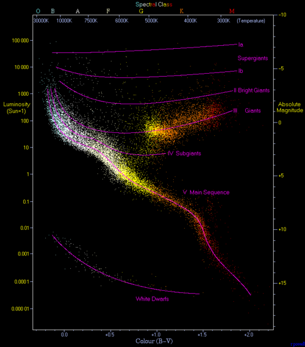

<h3 align="center">Hey! 🌐</h3>

📊 - Junior Data Analyst at **Infocar Technology**  .\
🎓 - Graduate in **Systems Analysis and Development** @[Universidade Cruzeiro do Sul](https://www.cruzeirodosul.edu.br) .\
🔬 - Strong academic interest in research-oriented data analysis, statistical modeling and scientific computing.\
🌌 - Strong interest in **Unix-based systems** applied to **astronomical research**, scientific computing and **large-scale data analysis**.\

### Projects 
- Stack: `Python`, `SQL`, `Pandas`, `NumPy`, `Matplotlib`, `Cloud Services`,  ...
- Focused on projects involving data analysis, statistical modeling and scientific computing.
- Development of data-driven workflows for:
  - Exploratory Data Analysis (EDA)
  - **Statistical analysis** and hypothesis testing
  - Data cleaning, transformation and visualization
🌌- Academic-oriented projects applying computational methods to **physics-related** problems, including:
  - Numerical simulations
  - Time-series analysis
  - **Data analysis** inspired by physical and astronomical systems
🐧- Experience building reproducible **computational environments** using containers and **Unix-based systems** for data and scientific research.

### Reach me at

  
  

<!-- 
## Stats: 📊

 
    
    </td></tr></table>

<!-- 

  

 -->
